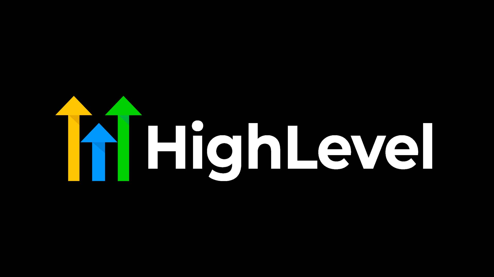

# Go High Level Python

Go Highlevel Python ease of use library implementation to their API


 
<br/>

<br/>


Go Highlevel ease of use library implementation to their API. Make sure you've create a Go Highlevel App in the <a href="https://marketplace.gohighlevel.com/" target="_blank">Market Place</a>


## Brief Overview of the Library
We recommend that you glance over the official <a href="https://highlevel.stoplight.io/docs/integrations/0443d7d1a4bd0-overview" target="_blank">Go Highlevel Documentation</a>. We have tried to make the library have a corresponding function for each endpoint. Enjoy the intellisense!


## Initialization
```
import { Gohighlevel } from 'gohighlevel'; // const { Gohighlevel } = require('gohighlevel');

// Create Instance of Gohighlevel
const GHL = new Gohighlevel({
    // App Info from GHL Market Place
    clientId: process.env.CLIENT_ID,
    clientSecret: process.env.CLIENT_ID_SECRET,
    redirectUri: process.env.REDIRECT_URI,
    
    isWhiteLabel: true,
    scopes: ["contacts.readonly", "contacts.write", "locations.readonly"]
})
```


### OAuth URL
```
// use the scopes when initializing -> new Gohighlevel({ ... })
let url = GHL.oauth.getOAuthURL()
    
// or if you want to add scopes this way
url = GHL.oauth
    // you can add the necessary scopes for your 
    // using the Builder Design Pattern
    .scopeBusinessesReadonly()
    .scopeBusinessesWrite()
    .scopeCalendarsReadonly()
    .scopeCalendarsEventsWrite()

    // get the oauth URL
    .getOAuthURL()

```


### OAuth Callback
```
async function callback(req, res){
   // Get Auth Info
   const code = req.query.code;
   const refresh_token = req.query.refresh_token;
   const authInfo = await GHL.oauth.getCallbackAuthTokens({
        code: code,
        refresh_token: refresh_token
    });

   // log token values 
   console.log(authInfo.access_token, authInfo.refresh_token, authInfo.expires_in)
   
   // Set Auth Info
   GHL.setAuth(authInfo);
}
```


### Use the API i.e Getting Contacts
```
// Use GHL API
// Corresponse with the endpoint - https://highlevel.stoplight.io/docs/integrations/ab55933a57f6f-get-contacts
const contacts = await GHL.getContacts();
console.log(contacts);
```


## Support
You can support us with any amount. It's all appreciated.

<a href="https://www.buymeacoffee.com/m2kdevelopments" target="_blank">
    
</a>

<a href="https://paypal.me/m2kdevelopment" target="_blank">
    
</a>

